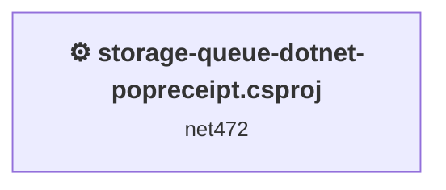
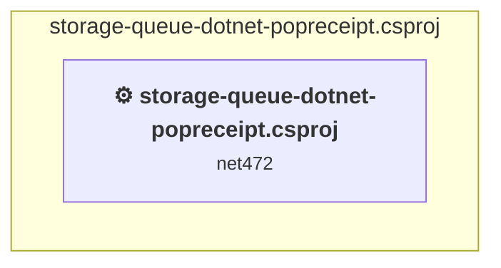

# Projects and dependencies analysis

This document provides a comprehensive overview of the projects and their dependencies in the context of upgrading to .NETCoreApp,Version=v10.0.

## Table of Contents

- [Executive Summary](#executive-Summary)
  - [Highlevel Metrics](#highlevel-metrics)
  - [Projects Compatibility](#projects-compatibility)
  - [Package Compatibility](#package-compatibility)
  - [API Compatibility](#api-compatibility)
  - [Binding Redirect Configuration](#binding-redirect-configuration)
- [Aggregate NuGet packages details](#aggregate-nuget-packages-details)
- [Top API Migration Challenges](#top-api-migration-challenges)
  - [Technologies and Features](#technologies-and-features)
  - [Most Frequent API Issues](#most-frequent-api-issues)
- [Projects Relationship Graph](#projects-relationship-graph)
- [Project Details](#project-details)

  - [storage-queue-dotnet-popreceipt\storage-queue-dotnet-popreceipt.csproj](#storage-queue-dotnet-popreceiptstorage-queue-dotnet-popreceiptcsproj)

## Executive Summary

### Highlevel Metrics

| Metric | Count | Status |
| :--- | :---: | :--- |
| Total Projects | 1 | All require upgrade |
| Total NuGet Packages | 9 | 8 need upgrade |
| Total Code Files | 2 |  |
| Total Code Files with Incidents | 3 |  |
| Total Lines of Code | 383 |  |
| Total Number of Issues | 16 |  |
| Estimated LOC to modify | 1+ | at least 0.3% of codebase |

### Projects Compatibility

| Project | Target Framework | Difficulty | Test Coverage | Package Issues | API Issues | Binding Issues | Est. LOC Impact | Description |
| :--- | :---: | :---: | :---: | :---: | :---: | :---: | :---: | :--- |
| [storage-queue-dotnet-popreceipt\storage-queue-dotnet-popreceipt.csproj](#storage-queue-dotnet-popreceiptstorage-queue-dotnet-popreceiptcsproj) | net472 | 🟢 Low | 🧪 Recommended | 10 | 1 | 3 | 1+ | ClassicDotNetApp, Sdk Style = False |

🧪 **Test Coverage** — projects risky enough to add behavior-locking tests before upgrading, to catch regressions the upgrade may introduce. Requires the **dotnet-test** plugin.

### Package Compatibility

| Status | Count | Percentage |
| :--- | :---: | :---: |
| ✅ Compatible | 1 | 11.1% |
| ⚠️ Incompatible | 7 | 77.8% |
| 🔄 Upgrade Recommended | 1 | 11.1% |
| ***Total NuGet Packages*** | ***9*** | ***100%*** |

### API Compatibility

| Category | Count | Impact |
| :--- | :---: | :--- |
| 🔴 Binary Incompatible | 0 | High - Require code changes |
| 🟡 Source Incompatible | 1 | Medium - Needs re-compilation and potential conflicting API error fixing |
| 🔵 Behavioral change | 0 | Low - Behavioral changes that may require testing at runtime |
| ✅ Compatible | 292 |  |
| ***Total APIs Analyzed*** | ***293*** |  |

### Binding Redirect Configuration

| Severity | Count | Description |
| :--- | :---: | :--- |
| 🔴Mandatory | 2 | Must be fixed to avoid runtime failures |
| 🟡Potential | 1 | May cause issues in certain scenarios |
| ***Total Binding Issues*** | ***3*** | ***Across 1 project(s)*** |

## Aggregate NuGet packages details

| Package | Current Version | Suggested Version | Projects | Description |
| :--- | :---: | :---: | :--- | :--- |
| Microsoft.Azure.KeyVault.Core | 1.0.0 | 3.0.5 | [storage-queue-dotnet-popreceipt.csproj](#storage-queue-dotnet-popreceiptstorage-queue-dotnet-popreceiptcsproj) | ⚠️NuGet package is incompatible |
| Microsoft.Data.Edm | 5.8.1 | 5.8.5 | [storage-queue-dotnet-popreceipt.csproj](#storage-queue-dotnet-popreceiptstorage-queue-dotnet-popreceiptcsproj) | ⚠️Replace with Microsoft.OData.Edm: Use OData v4 model types; adjust EDM model builders |
| Microsoft.Data.OData | 5.8.1 | 5.8.5 | [storage-queue-dotnet-popreceipt.csproj](#storage-queue-dotnet-popreceiptstorage-queue-dotnet-popreceiptcsproj) | ⚠️Replace with Microsoft.OData.Core: Align code with OData v4; adjust URI/query conventions |
| Microsoft.Data.Services.Client | 5.8.1 | 5.8.5 | [storage-queue-dotnet-popreceipt.csproj](#storage-queue-dotnet-popreceiptstorage-queue-dotnet-popreceiptcsproj) | ⚠️Replace with Microsoft.OData.Client: Regenerate client proxy for OData v4; adjust entity operations accordingly |
| Microsoft.ProjectOxford.Face | 1.2.1.2 |  | [storage-queue-dotnet-popreceipt.csproj](#storage-queue-dotnet-popreceiptstorage-queue-dotnet-popreceiptcsproj) | ⚠️NuGet package is incompatible |
| Microsoft.WindowsAzure.ConfigurationManager | 3.2.3 |  | [storage-queue-dotnet-popreceipt.csproj](#storage-queue-dotnet-popreceiptstorage-queue-dotnet-popreceiptcsproj) | ⚠️NuGet package is incompatible |
| Newtonsoft.Json | 9.0.1 | 13.0.4 | [storage-queue-dotnet-popreceipt.csproj](#storage-queue-dotnet-popreceiptstorage-queue-dotnet-popreceiptcsproj) | NuGet package upgrade is recommended |
| System.Spatial | 5.8.1 | 5.8.5 | [storage-queue-dotnet-popreceipt.csproj](#storage-queue-dotnet-popreceiptstorage-queue-dotnet-popreceiptcsproj) | ⚠️Replace with Microsoft.Spatial: Use OData v4 spatial types; adjust namespaces for geography/geometric classes |
| WindowsAzure.Storage | 8.0.0 |  | [storage-queue-dotnet-popreceipt.csproj](#storage-queue-dotnet-popreceiptstorage-queue-dotnet-popreceiptcsproj) | ✅Compatible |

## Top API Migration Challenges

### Technologies and Features

| Technology | Issues | Percentage | Migration Path |
| :--- | :---: | :---: | :--- |

### Most Frequent API Issues

| API | Count | Percentage | Category |
| :--- | :---: | :---: | :--- |
| M:System.TimeSpan.FromSeconds(System.Double) | 1 | 100.0% | Source Incompatible |

## Projects Relationship Graph

Legend:
📦 SDK-style project
⚙️ Classic project

## Project Details

### storage-queue-dotnet-popreceipt\storage-queue-dotnet-popreceipt.csproj

#### Project Info

- **Current Target Framework:** net472
- **Proposed Target Framework:** net10.0
- **SDK-style**: False
- **Project Kind:** ClassicDotNetApp
- **Dependencies**: 0
- **Dependants**: 0
- **Number of Files**: 2
- **Number of Files with Incidents**: 3
- **Lines of Code**: 383
- **Estimated LOC to modify**: 1+ (at least 0.3% of the project)

#### Dependency Graph

Legend:
📦 SDK-style project
⚙️ Classic project

### API Compatibility

| Category | Count | Impact |
| :--- | :---: | :--- |
| 🔴 Binary Incompatible | 0 | High - Require code changes |
| 🟡 Source Incompatible | 1 | Medium - Needs re-compilation and potential conflicting API error fixing |
| 🔵 Behavioral change | 0 | Low - Behavioral changes that may require testing at runtime |
| ✅ Compatible | 292 |  |
| ***Total APIs Analyzed*** | ***293*** |  |

#### Binding Redirect Configuration

| Rule | Severity | Details | Recommendation |
| :--- | :---: | :--- | :--- |
| Manual redirect conflicts with auto-generated version | 🔴Mandatory | Manual redirect for Newtonsoft.Json targets 9.0.0.0 but auto-generation would target 9.0.1 (MSB3836 conflict) | Remove the conflicting manual binding redirect or disable auto-generation. |
| Manual redirect conflicts with auto-generated version | 🔴Mandatory | Manual redirect for Microsoft.Azure.KeyVault.Core targets 2.0.0.0 but auto-generation would target 1.0.0 (MSB3836 conflict) | Remove the conflicting manual binding redirect or disable auto-generation. |
| Binding redirect forces version downgrade | 🟡Potential | Binding redirect for Newtonsoft.Json targets 9.0.0.0 but package provides 9.0.1 | Update the binding redirect newVersion to match the version provided by the NuGet package. |

